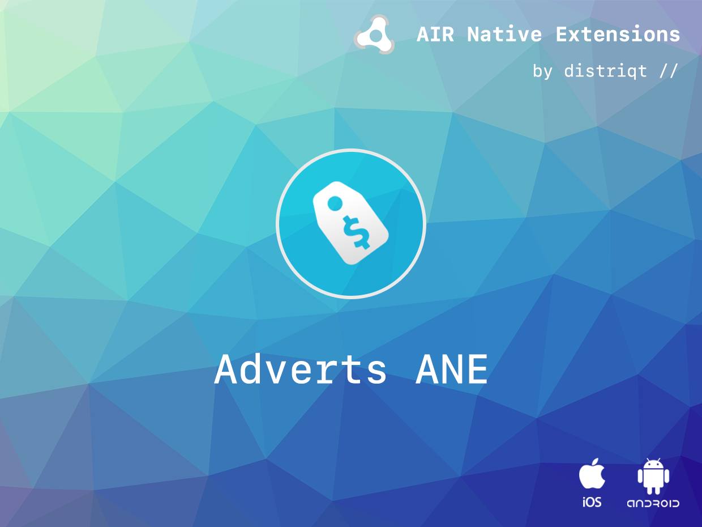

built by [distriqt //](https://airnativeextensions.com) 

# Adverts Mediation

These extensions allow you to add mediation networks with advertising platforms using the Adverts ANE.

Mediation is a feature that lets you serve ads to your apps from multiple sources, including the AdMob Network, third-party ad networks, and AdMob campaigns. AdMob Mediation helps maximize your fill rate and increase your monetization by sending ad requests to multiple networks to ensure you find the best available network to serve ads.

This guide is your one-stop shop for integrating mediation into your AdMob app.

They are designed to work with the distriqt [Adverts ANE](https://airnativeextensions.com/extension/com.distriqt.Adverts)
however should work with any recent AdMob implementation.

### Features:

- AdMob Mediation
    - [App Lovin](https://docs.airnativeextensions.com/docs/adverts/mediation/applovin)
    - [Facebook Audience](https://docs.airnativeextensions.com/docs/adverts/mediation/facebookaudience)
    - [IronSource](https://docs.airnativeextensions.com/docs/adverts/mediation/ironsource)
    - [TapJoy](https://docs.airnativeextensions.com/docs/adverts/mediation/tapjoy)
    - [Unity Ads](https://docs.airnativeextensions.com/docs/adverts/mediation/unityads)

## Documentation

Latest documentation can be found in the [documentation site](https://docs.airnativeextensions.com/docs/adverts)

